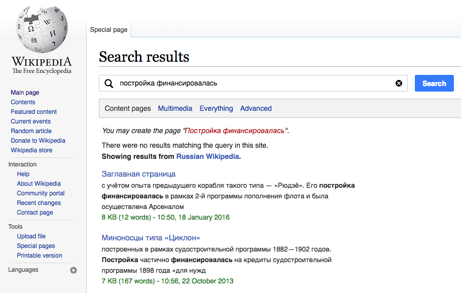

```{r setup, include = FALSE, message = FALSE, warning = FALSE}
knitr::opts_chunk$set(echo = FALSE, message = FALSE, warning = FALSE)
options(digits = 3)
library(magrittr)
library(tidyr)
import::from(dplyr, keep_where = filter, group_by, ungroup, summarize, select, rename, mutate, arrange, top_n, distinct, left_join, tally)
library(ggplot2)
library(cowplot)
library(BCDA)
import::from(BCDA, flip_cols)
import::from(BCDA, flip_rows)
```

```{r extra_eda_functions}
prop_df <- function(x, margin) {
  if (all(margin == 1:2)) {
    return(x/sum(x))
  }
  return(t(apply(x, margin, function(y) {
    return(y/sum(y))
  })))
}
add_props <- function(x, margin = NULL) {
  if (is.data.frame(x)) {
    y <- prop_df(x, margin)
  } else if (is.table(x) || is.array(x)) {
    y <- prop.table(x, margin)
  }
  z <- x
  for (i in 1:nrow(x)) {
    for (j in 1:ncol(x)) {
      z[i, j] <- sprintf("%.0f (%.2f%%)", x[i, j], 100 * y[i, j])
    }
  }
  return(z)
}
to_ordinal <- function(x) {
  return(vapply(x, toOrdinal::toOrdinal, ""))
}
```

\renewcommand{\abstractname}{\Large Executive Summary}
\begin{abstract}
\large
Our current efforts to increase relevancy of search results rely on language detection (via the TextCat library) to provide the user with results from a potentially more relevant alternate language. For example, users who were enrolled in the test group and searched English Wikipedia in French received additional ``interwiki" results from French Wikipedia.

The test groups not only had a substantially lower zero results rate (57\% in control group vs 46\% in the two test groups), but they had a higher clickthrough rate (44\% in the control group vs 49-50\% in the two test groups), indicating that we may be providing users with relevant results that they would not have gotten otherwise. Interestingly, users first clicked on the first and second search results from same-language wiki, rather than the potentially more relevant interwiki results.

We recommend continuing our work with TextCat and possibly deploying it to production. We should consider recording the confidence of the language detection, as there may be a correlation between the confidence -- a proxy for the potential relevancy of the results -- and the likelihood that the user will click on the interwiki result(s).
\end{abstract}

\normalsize

\newpage

## Introduction

In our investigation of search queries, we have found that sometimes people write search queries in a language different from the language of the wiki they are searching. Sometimes this works (some articles may have translations on the page) and sometimes it does not. So we asked ourselves, "What if we could detect the language of the query and then if the user did not get many -- if any -- results on their current wiki, what if just searched the potentially correct wiki and gave the user THOSE results?" To that end, we decided to proceed with adding language detection to Cirrus search (see [T118278](https://phabricator.wikimedia.org/T118278)).



[TextCat](https://www.mediawiki.org/wiki/TextCat) is a software library for detecting language based on [n-gram text categorization](https://en.wikipedia.org/wiki/N-gram), which we ported to PHP for use in Cirrus search. In this initial A/B test of the TextCat software, we deployed the code to English, French, Spanish, Italian, and German Wikipedias ("enwiki", ..., "dewiki" = "same-wiki") to determine how people engage with the "interwiki" results (results from a Wikipedia in another language).

## Methods

Test group users who received less than 3 same-wiki results and whose language we were able to detect (using either TextCat or combination of TextCat and Accept-Language header) received [interwiki results](https://en.wikipedia.org/w/index.php?fulltext=1&search=постройка+финансировалась&cirrusUserTesting=textcat2:b). We still tried to detect a language for users in the control group so they experience the same lag that the users in the test groups did; this also makes for more valid comparisons. Our [initial attempt](https://phabricator.wikimedia.org/T121542) ran from 16 March 2016 to 31 May 2016, but a few issues with the data (see [T137158#2359494](https://phabricator.wikimedia.org/T137158#2359494)) meant that we had to resolve them and then restart the test. The [second attempt](https://phabricator.wikimedia.org/T137163) ran from 16 June 2016 to 05 July 2016. A total of 49,623 sessions (users) and 116,462 searches were recorded using the MediaWiki Event Logging system. The data analysis was performed using [R](https://www.r-project.org/) in [RStudio](https://www.rstudio.com/) and the packages: magrittr, uaparser, dplyr, tidyr, and [BCDA](https://github.com/bearloga/BCDA).

## Results

```{r data}
load("data/textcat-enwiki-abtest-extended-refined.RData")
```

In Table 1, we see that the proportion of sessions (which perform multiple searches) for which we could detect a language is nearly double the proportion of sessions for which we could not. Nearly the opposite holds for proportion of individual searches.

```{r eda_langdetect}
searches %>%
  keep_where(session_id %in% valid_session_ids) %>%
  group_by(wiki, `Detected a language` = ifelse(detected_language, "Detected", "Did not detect")) %>%
  summarize(searches = length(unique(page_id)), sessions = length(unique(session_id))) %>%
  mutate(`searches (proportion)` = searches/sum(searches), `sessions (proportion)` = sessions/sum(sessions)) %>%
  select(wiki, `Detected a language`, searches, `searches (proportion)`, sessions, `sessions (proportion)`) %>%
  knitr::kable(caption = "Number of sessions and individual searches within them where we detected or did not detect a language.")
```

While the zero results rate is not the key metric of interest to us in this particular test, we still want to make sure that we are seeing the numbers we might expect. In Table 2, we can see that groups who received the additional interwiki results had a substantially lower zero results rate, which makes sense.

```{r eda_zrr}
results <- searches %>%
  keep_where(detected_language) %>%
  group_by(group = test_group, results = ifelse(results_returned == 0, "zero results", "some results")) %>%
  tally() %>%
  spread(results, n) %>%
  # mutate(`zero results rate` = `zero results`/(`zero results` + `some results`)) %>%
  ungroup
results[, 2:3] <- add_props(results[, 2:3], 1)
knitr::kable(results[, c(1, 3, 2)], caption = "Searches where we could detect a language had a much lower zero results rate when using interwiki results via TextCat and Accept-Language header language detection.")
```

In the clickthrough analyses that follow, we only use sessions for which we detected a language and which had some search results.

```{r eda_group_counts, results = 'asis'}
results <- events %>%
  keep_where(session_id %in% valid_session_ids) %>%
  distinct(wiki, test_group, session_id) %>%
  group_by(wiki, test_group) %>%
  tally() %>%
  spread(test_group, n)
results[, 2:4] <- add_props(results[, 2:4], 1)
knitr::kable(results, caption = "Number of sessions (for which we detected a language in one of the search queries) per group per wiki.")
```

```{r eda_ctr_by_group_samewiki_only, results = 'asis'}
results_1 <- sessions %>%
  mutate(any_enwiki_clicks = ifelse(any_enwiki_clicks, "Clicked a same-wiki result", "Did not")) %>%
  group_by(wiki, group = ifelse(test_group == "a (control)", "controls", "test"),
           any_enwiki_clicks) %>%
  tally() %>%
  spread(any_enwiki_clicks, n) %>%
  mutate(ctr = `Clicked a same-wiki result`/(`Clicked a same-wiki result` + `Did not`)) %>%
  xtabs(ctr ~ group + wiki, data = .)
results_2 <- sessions %>%
  mutate(any_enwiki_clicks = ifelse(any_enwiki_clicks, "Clicked a same-wiki result", "Did not")) %>%
  group_by(group = ifelse(test_group == "a (control)", "controls", "test"),
           any_enwiki_clicks) %>%
  tally() %>%
  spread(any_enwiki_clicks, n) %>%
  mutate(ctr = `Clicked a same-wiki result`/(`Clicked a same-wiki result` + `Did not`)) %>%
  xtabs(ctr ~ group, data = .)
knitr::kable(cbind(results_1, overall = results_2), caption = "Proportion of sessions that clicked specifically on a 'same-language' (En/Fr/Es/It/De) Wikipedia result. The two test groups ('b' and 'c') have been combined into a single group.")
```

```{r cda_ctr_by_group_samewiki_only, results = 'asis'}
set.seed(0)
test_1 <- sessions %>%
  mutate(any_enwiki_clicks = ifelse(any_enwiki_clicks, "Clicked a same-wiki result", "Did not")) %>%
  group_by(group = ifelse(test_group == "a (control)", "controls", "test"),
           any_enwiki_clicks) %>%
  tally() %>%
  xtabs(n ~ group + any_enwiki_clicks, data = .) %>%
  flip_rows() %>%
  beta_binom
```

```{r eda_ctr_by_group_combined, results = 'asis'}
results_1 <- sessions %>%
  mutate(clickthrough = ifelse(clickthrough, "Clicked a result", "Did not")) %>%
  group_by(wiki, group = ifelse(test_group == "a (control)", "controls", "test"),
           clickthrough) %>%
  tally() %>%
  spread(clickthrough, n) %>%
  mutate(ctr = `Clicked a result`/(`Clicked a result` + `Did not`)) %>%
  xtabs(ctr ~ group + wiki, data = .)
results_2 <- sessions %>%
  mutate(clickthrough = ifelse(clickthrough, "Clicked a result", "Did not")) %>%
  group_by(group = ifelse(test_group == "a (control)", "controls", "test"),
           clickthrough) %>%
  tally() %>%
  spread(clickthrough, n) %>%
  mutate(ctr = `Clicked a result`/(`Clicked a result` + `Did not`)) %>%
  xtabs(ctr ~ group, data = .)
knitr::kable(cbind(results_1, overall = results_2), caption = "Clickthrough rates across the five Wikipedias. The two test groups ('b' and 'c') have been combined into a single 'test' group.")
```

```{r cda_ctr_by_group_combined, results = 'asis'}
test_2 <- sessions %>%
  mutate(clickthrough = ifelse(clickthrough, "Clicked a result", "Did not")) %>%
  group_by(group = ifelse(test_group == "a (control)", "controls", "test"),
           clickthrough) %>%
  tally() %>%
  xtabs(n ~ group + clickthrough, data = .) %>%
  flip_rows() %>%
  beta_binom
```

```{r eda_ctr_by_group, results = 'asis'}
results_1 <- sessions %>%
  mutate(clickthrough = ifelse(clickthrough, "Clicked a result", "Did not")) %>%
  group_by(wiki, group = test_group, clickthrough) %>%
  tally() %>%
  spread(clickthrough, n) %>%
  mutate(ctr = `Clicked a result`/(`Clicked a result` + `Did not`)) %>%
  xtabs(ctr ~ group + wiki, data = .)
results_2 <- sessions %>%
  mutate(clickthrough = ifelse(clickthrough, "Clicked a result", "Did not")) %>%
  group_by(group = test_group, clickthrough) %>%
  tally() %>%
  spread(clickthrough, n) %>%
  mutate(ctr = `Clicked a result`/(`Clicked a result` + `Did not`)) %>%
  xtabs(ctr ~ group, data = .)
  knitr::kable(cbind(results_1, overall = results_2), caption = "Clickthrough rates across the five Wikipedias. For the groups 'b' and 'c', these clickthrough rates account for both types of results that could be clicked -- same-wiki and interwiki.")
```

```{r cda_ctr_by_group}
temp <- sessions %>%
  mutate(clickthrough = ifelse(clickthrough, "Clicked a result", "Did not")) %>%
  group_by(group = test_group, clickthrough) %>%
  tally() %>%
  xtabs(n ~ group + clickthrough, data = .)
test_3 <- beta_binom(temp[c(2, 1), ]) # B vs A
test_4 <- beta_binom(temp[c(3, 1), ]) # C vs A
test_5 <- beta_binom(temp[c(2, 3), ]) # B vs C
rm(temp)
```

```{r eda_results}
# nrow(keep_where(searches, detected_language, test_group != "a (control)", clickthrough)) # 1647
searches %>%
  keep_where(detected_language, test_group != "a (control)", clickthrough) %>%
  group_by(interwiki = ifelse(zero_interwiki_results, "zero interwiki results", "some interwiki results"),
           enwiki = ifelse(zero_enwiki_results, "zero same-wiki results", "some same-wiki results")) %>%
  tally() %>%
  xtabs(n ~ interwiki + enwiki, data = .) %>%
  add_props %>%
  knitr::kable(caption = "Counts and proportions of searches with some or no En/Fr/Es/It/De Wikipedia results and some or no interwiki results where we detected a language and the user clicked on a result.")
```

## Conclusion

This initial evidence suggests that using TextCat to detect language and present the users with additional results from the Wikipedia in the detected language has a benefit for the users. We suggest recording the confidence of the language detection. That is, perhaps the number of searches where the user clicked on an interwiki result first rather than current wiki is high for searches where we have a very high confidence ("Oh yeah, that's definitely the language they are searching in but just are on the wrong wiki.") of correctly detecting the user's language, compared to those searches where our detection can be best described as, "Well, I guess this could be the language they were trying to search in." Trey Jones [began working on this](https://www.mediawiki.org/wiki/User:TJones_(WMF)/Notes/TextCat_and_Confidence).

\newpage

\newgeometry{left = 0.5in, bottom = 0.5in}

\begin{landscape}

```{r bcda_compilation, include = FALSE}
present_bbfit(list("Clicked on a same-wiki result" = test_1,
                   "Clicked on a result ('test' vs 'controls')" = test_2,
                   "Clicked on a result ('b' vs 'a')" = test_3,
                   "Clicked on a result ('c' vs 'a')" = test_4,
                   "Clicked on a result ('b' vs 'c')" = test_5),
              digits = 2, format = "latex")
```

\begin{table}
\caption{The results of a Bayesian analysis using the Beta-Binomial model of clickthrough rates by group. The test group(s) were more likely to clickthrough on a result than the controls (who did not receive interwiki results).}
\centering
\renewcommand{\arraystretch}{1.8}% for the vertical padding
\begin{tabular}[t]{l|r|r|l|l|l|l|l}
\hline
\textbf{Outcome} & $N_\text{1}$ & $N_\text{2}$ & $P_\text{1}$ & $P_\text{2}$ & \textbf{Difference} ($P_\text{1} - P_\text{2}$) & \textbf{Relative Risk} & \textbf{Odds Ratio}\\
\hline
Clicked on a same-wiki result & 5065 & 1263 & 42.67\% (41.30\%, 44.04\%) & 44.43\% (41.73\%, 47.17\%) & -1.77\% (-4.86\%, 1.28\%) & 0.96 (0.90, 1.03) & 0.93 (0.82, 1.05)\\
\hline
\rowcolor{LightYellow}
Clicked on a result ('test' vs 'controls') & 5065 & 1263 & 48.88\% (47.49\%, 50.24\%) & 44.41\% (41.63\%, 47.21\%) & 4.47\% (1.36\%, 7.55\%) & 1.10 (1.03, 1.18) & 1.20 (1.06, 1.36)\\
\hline
\rowcolor{LightYellow}
Clicked on a result ('b' vs 'a') & 2334 & 1263 & 48.71\% (46.70\%, 50.65\%) & 44.43\% (41.66\%, 47.19\%) & 4.28\% (0.91\%, 7.61\%) & 1.10 (1.02, 1.18) & 1.19 (1.04, 1.36)\\
\hline
\rowcolor{LightYellow}
Clicked on a result ('c' vs 'a') & 2731 & 1263 & 49.02\% (47.14\%, 50.90\%) & 44.42\% (41.68\%, 47.14\%) & 4.61\% (1.29\%, 7.87\%) & 1.10 (1.03, 1.19) & 1.21 (1.05, 1.37)\\
\hline
Clicked on a result ('b' vs 'c') & 2334 & 2731 & 48.73\% (46.70\%, 50.72\%) & 49.02\% (47.11\%, 50.88\%) & -0.28\% (-3.04\%, 2.43\%) & 0.99 (0.94, 1.05) & 0.99 (0.89, 1.10)\\
\hline
\end{tabular}
\end{table}

\end{landscape}
